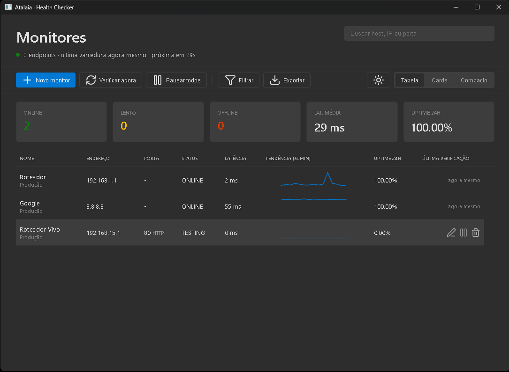

# 🔍 Atalaia - Health Checker

**Atalaia** é uma ferramenta de monitoramento de infraestrutura leve e poderosa, desenvolvida para fornecer visibilidade em tempo real sobre a saúde de servidores, endpoints e serviços de rede.



## 📦 Download das Versões
Baixe a versão mais recente para o seu sistema operacional diretamente das nossas releases automatizadas:

🚀 **[Baixar Atalaia (Windows, macOS, Linux)](https://github.com/ooclaar/atalaia-monitor/actions/runs/26491290408)**

---

## ✨ Funcionalidades Principais

### 🖥️ Interface Adaptável (3 Modos de Visualização)
- **Tabela Detalhada:** Visão técnica completa com gráficos de tendência (sparklines).
- **Cards Modernos:** Foco em métricas de performance e histórico visual de uptime.
- **Modo Compacto:** Layout denso para monitoramento em larga escala.

### 📊 Métricas de Alta Precisão
- **Uptime Real:** Cálculo dinâmico baseado no histórico efetivo de testes.
- **Latência Inteligente:** Média global que reflete apenas hosts ativos.
- **Tempo Relativo:** Feedback instantâneo de "há quanto tempo" ocorreu a última verificação.

### 🛠️ Controle e Agilidade
- **Edição em Tempo Real:** Altere configurações de monitores sem interromper o fluxo.
- **Ações em Hover:** Interface minimalista com controles que surgem ao passar o mouse.
- **Filtros Rápidos:** Busca instantânea por Nome, IP ou Porta.

---

## 🚀 Como Rodar Localmente

### Pré-requisitos
- [Node.js](https://nodejs.org/) (v20+)

### Instalação
```bash
git clone https://github.com/ooclaar/atalaia-monitor.git
cd atalaia-monitor
npm install
npm start
```

### Build do Projeto
Para gerar o executável para sua máquina:
```bash
npm run build
```

---
Desenvolvido por **Chief** & Manus.
Focado em **Segurança, Infraestrutura e Performance**.
